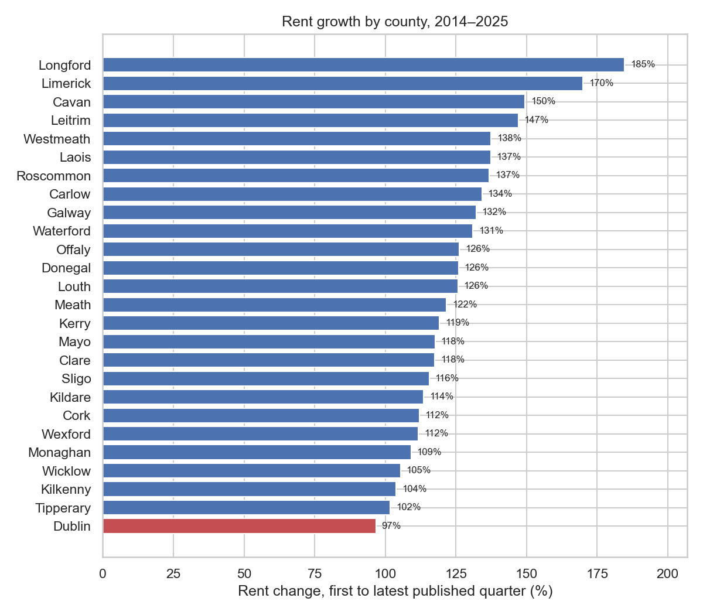
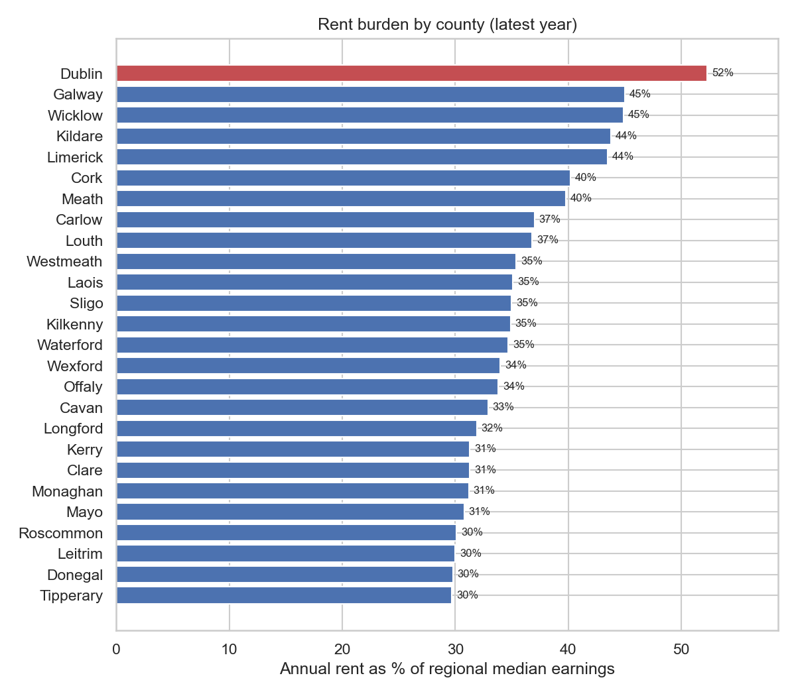
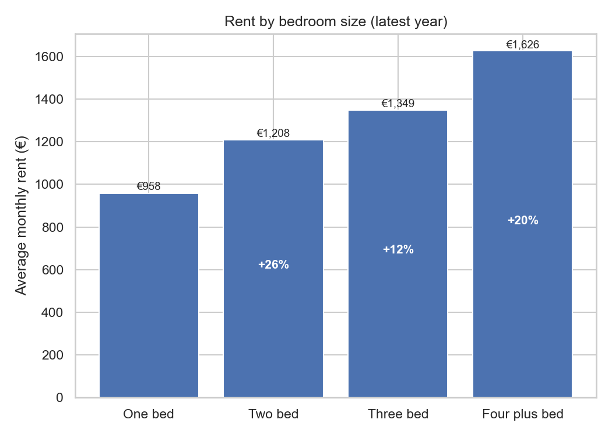

# Ireland Rental Market Analysis (2014 to 2025)

How rents in Ireland have moved over the last decade, broken down by county, dwelling type, and bedroom count, with a look at where rent is hardest to afford relative to local wages.

**Tableau Public dashboard:** [Ireland Rental Analysis](https://public.tableau.com/app/profile/kosisochukwu.obiabumuo/viz/IrelandRentalAnalysis/Dashboard)

## The question

Where in Ireland has rent grown fastest, where is it most unaffordable compared to what people actually earn, and how much extra does each additional bedroom cost?

## Key findings

Full working is in `notebooks/03_analysis.ipynb`, which reads the SQL views in `sql/`.

**1. The fastest rent rises happened in smaller inland counties, not the cities.**

Comparing each county's earliest published quarter to its latest, Longford rents rose the most, up 184.7% (from about €400 to €1,140 a month). Limerick (+170%) and Cavan (+149.5%) came next. Dublin actually saw the *smallest* percentage rise at +96.7%, but it started from the highest base by far (€1,105 up to €2,173), so in plain euro terms the gap there is still the widest of anywhere.



**2. Dublin renters hand over the biggest slice of their local wages.**

Taking the latest year's average rent, annualising it, and dividing by the median earnings for that county's region, Dublin comes out most stretched: rent eats 52.3% of median regional income. Galway (45.0%) and Wicklow (44.9%) follow. Tipperary is the easiest place to rent relative to what people earn there, at 29.7%.



**3. The first extra bedroom is the one that really stings.**

Nationally, in the latest year, moving from a one-bed (€958) to a two-bed (€1,208) adds 26% to the rent, the biggest jump of the lot. A third bedroom is a gentler step up (€1,349, +12%), and four-plus beds climb again to €1,626 (+21%).



## Data sources

All public, no scraping.

* **RTB Rent Index** from the Residential Tenancies Board. Quarterly average rents by county, dwelling type, and bedroom count.
* **CSO Ireland**, earnings data used to build the affordability ratio (rent over local income).
* **Property Price Register**, residential sale prices since 2010.

Source URLs and the date each file was downloaded live in `data/README.md`.

## Tools used

* Python (pandas) for cleaning and analysis
* PostgreSQL for the SQL layer
* Tableau Public for the dashboard
* Jupyter for the analysis notebooks

## How to reproduce

```bash
git clone https://github.com/KosisoObiabumuo/ireland-rental-analysis.git
cd ireland-rental-analysis
uv sync
uv run jupyter lab
```

To rebuild the database tables, drop the source files into `data/raw/` (see `data/README.md` for what goes where), then run `uv run python scripts/load_to_postgres.py`.

## Limitations

A few honest caveats up front.

* The RTB index covers registered tenancies only, so the more informal end of the rental market (rent a room, short term lets) is not in the data.
* County level averages hide a lot of within-county variation. Dublin city centre and the outer suburbs are very different markets.
* CSO earnings data is reported by region, not always by exact county, so the affordability ratio is approximate. Counties in the same region share one earnings figure, which is why they only separate out by their rents.
* Earnings data stops at 2024, so the affordability numbers for 2025 rents are measured against 2024 wages. If pay rose in 2025, the real burden is a touch lower than shown.
* The growth figures use each county's own first and last published quarter, not a single fixed window, because not every county has a reading going all the way back to 2014Q1. Counties that start reporting later will show growth over a slightly shorter span.
* The Property Price Register has some extreme outliers, single rows recording bulk or portfolio sales worth tens of millions of euro. Anywhere sale prices are summarised I lean on the median rather than the mean so those don't distort the picture.

## About me

I am Kosiso, a third year student in Ireland. This is a portfolio project I built after finishing the Google Data Analytics certificate on Coursera. Open to data analytics internships for summer 2026.

LinkedIn: _add link_
